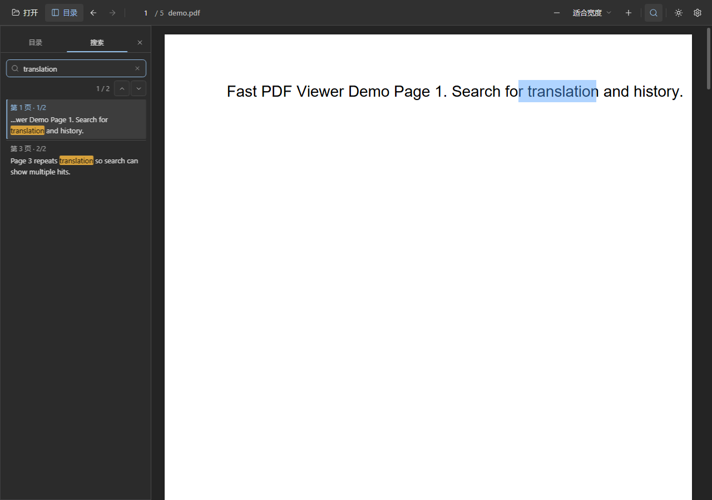
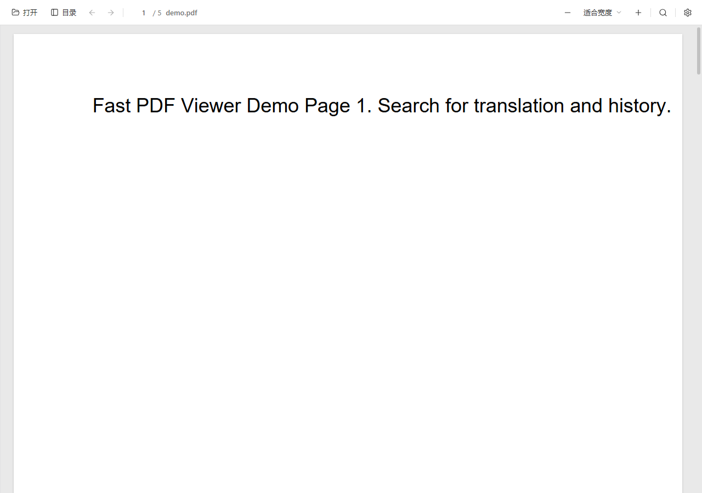

# 速览 Fast PDF Viewer

<p align="center">
  <strong>为技术文档而生的轻量 PDF 阅读器</strong> —— 极速打开、连续滚动、层级目录定位、全文侧栏搜索、划词 AI 翻译与双主题切换。
</p>

<p align="center">
  
</p>

> 默认采用深色阅读界面与紧凑工具栏，侧栏整合目录与搜索，开箱即用。克隆仓库后运行 `fast-pdf` 或 `python desktop/app.py` 即可体验。

---

## 界面预览

| 深色模式与侧栏搜索 | 浅色模式阅读 |
| :---: | :---: |
|  |  |

---

## 为什么选择速览？

现代浏览器（Edge / Chrome）内置的 PDF 预览在处理技术手册时常有痛点：

- **长文档负担重**：数百页芯片手册或工程指南打开较慢，滚动不够流畅。
- **跳转易迷失**：从目录或搜索结果跳转后，**难以原路返回**刚才阅读的段落。
- **搜索体验简陋**：缺少条目式的命中列表，无法清晰感知「当前第几条 / 共几条」。
- **缺少划词翻译**：阅读英文技术文档时，频繁在阅读器与外部翻译工具之间切换会打断思路。

速览专注于 **纯粹的文档阅读体验**：不改写文档、不加水印签名、不强求云端账号，将屏幕空间与算力全部留给阅读本身。

---

## 核心特性

| 功能模块 | 特性说明 |
| :--- | :--- |
| **快速打开** | 基于 pdf.js 按需渲染，采用默认 8 页的动态缓存策略，大文档即开即读。 |
| **流畅滚动** | 由 IntersectionObserver 驱动预取与动态排版，连续高速滚动保持约 60 FPS。 |
| **层级目录** | 树状目录展示，支持长标题省略与提示；配备一键「全部展开」与「全部折叠」功能。 |
| **精准章节定位** | 单页包含多个小节（如 1.1、1.2、1.3）时，根据视口阅读坐标高亮当前小节，不再机械停留在页末。 |
| **侧栏全文搜索** | 搜索框、结果计数（如 **3 / 47**）与前后翻页整合于侧栏；支持文本摘要高亮和逐项跳转。 |
| **双向历史导航** | 浏览器式前进与后退，支持鼠标侧键、`Alt+←` / `Alt+→` 与 `Backspace`，跳转后可一键原路返回。 |
| **双主题切换** | 预置深色（Dark）与浅色（Light）两种阅读主题，切换即时生效，本地记住偏好且启动防白屏闪烁。 |
| **阅读进度记忆** | 记录每个文档的上次阅读页码与滚动偏移（存放在本机 `localStorage`），再次打开自动复原。 |
| **划词 AI 翻译** | 选中文本即出翻译气泡，支持流式输出、取消与重试；提供模型联想筛选，仅在聚焦模型项时按需展示。 |
| **桌面与 Web 兼备** | 桌面端基于 Python + WebView2；无桌面环境时自动降级为本地浏览器服务，**PDF 文件完全在本地处理，绝不上传**。 |

---

## 快速开始

### 推荐运行环境

- 系统：Windows 10 / 11
- 环境：Python 3.10+

```powershell
# 1. 克隆代码仓库
git clone https://github.com/Stewart222b/fast-pdf-viewer.git
cd fast-pdf-viewer

# 2. 安装本地可编辑包（包含 pywebview 等依赖）
python -m pip install -e .

# 3. 启动阅读器
fast-pdf
```

打开指定 PDF 文件：

```powershell
fast-pdf D:\docs\manual.pdf
```

若环境中未安装 `pywebview`（或需要直接在浏览器中使用），使用 `--browser` 参数通过系统默认浏览器打开：

```powershell
fast-pdf --browser
```

首次启动时，程序会自动下载配套的 pdf.js 静态资源至 `web/vendor/pdfjs/` 目录。

---

### 其他安装与运行方式

| 方式 | 运行命令 | 说明 |
| :--- | :--- | :--- |
| **经典 pip** | `pip install -r requirements.txt`<br>`python desktop/app.py` | 适合普通 Python 虚拟环境。 |
| **pipx（独立隔离）** | `pipx install -e .`<br>或 `pipx run --spec git+https://github.com/Stewart222b/fast-pdf-viewer.git fast-pdf` | 适合不想影响系统全局 Python 环境的场景。 |
| **uv** | `uv tool install -e .` | 使用现代包管理器 [uv](https://github.com/astral-sh/uv) 极速安装与管理工具。 |
| **纯网页模式** | `python desktop/app.py --browser`<br>打开 `http://127.0.0.1:17831/` | 在网页中点击按钮选择本地文件，或直接将 PDF 拖入窗口。 |

---

## 常用快捷键

| 操作类别 | 操作描述 | 快捷键 / 鼠标动作 |
| :--- | :--- | :--- |
| **文件操作** | 打开本地 PDF 文件 | `Ctrl+O`，或直接拖拽文件至窗口内 |
| **页面导航** | 返回上一个阅读位置 | 鼠标侧键（后退）、`Alt+←`、`Backspace` |
| | 前进到下一个跳转位置 | 鼠标侧键（前进）、`Alt+→` |
| | 快速跳页 | 点击页码输入框，输入目标页码后按 `Enter` |
| **全文搜索** | 展开侧栏搜索 / 聚焦搜索框 | `Ctrl+F`，或点击顶部搜索图标 |
| | 定位至上一个匹配结果 | `Shift+Enter`，或点击侧栏 `▲` 按钮 |
| | 定位至下一个匹配结果 | `Enter`，或点击侧栏 `▼` 按钮 |
| | 关闭侧栏搜索 | `Esc` |
| **视图缩放** | 放大 / 缩小 | `Ctrl + 滚轮`、`Ctrl+=` / `Ctrl+-` |
| | 缩放预设 | 展开缩放菜单选择「适合宽度」「适合页面」或百分比 |
| **弹窗与气泡** | 关闭设置弹窗 / 取消划词翻译气泡 | `Esc` |

---

## 划词 AI 翻译配置

速览内置轻量划词翻译引擎，选中文本即可就地显示译文气泡：

1. 点击工具栏右上角的 **⚙ 设置** 图标打开配置面板。
2. 配置服务参数：
   - **API Base URL**：兼容 OpenAI 标准的服务端点（默认为 `https://openrouter.ai/api/v1`）。
   - **API Key**：你的服务凭证（如 OpenRouter 的 `sk-or-v1-...`）。
   - **模型**：输入或从下拉推荐列表中选择模型（默认推荐 `openai/gpt-4o-mini`）。仅在聚焦模型输入框时才会展示过滤列表。
   - **目标语言**：支持简体中文、繁体中文、English、日本語等。
3. 在文档中 **鼠标划词**，系统将自动识别单词或段落并请求译文。你可以在气泡中随时点击「取消」「重试」或一键复制结果。

> 单次划词文本上限为 **4000** 个字符，默认请求超时时间为 60 秒。

---

## 隐私与安全

| 数据类别 | 存储位置与处理机制 |
| :--- | :--- |
| **API 密钥与服务地址** | 仅保存在本机浏览器的 `localStorage`（键名为 `fast-pdf-viewer-settings`），不会发送给任何第三方中间服务器。 |
| **阅读位置与进度** | 按文档内容特征计算指纹，仅保存在本机 `localStorage`，不收集阅读行为。 |
| **PDF 文件内容** | **桌面版**：通过本地 HTTP 服务利用 Range 请求高效按需加载；<br>**网页版**：通过浏览器本地 File API / Blob URL 读取，**全程不经由任何远程服务器流转**。 |
| **翻译数据** | 划词翻译时，仅将你选中的文本与配置的请求头从本机直接发送至你所指定的 API 端点。 |

---

## 本地开发与测试

### 环境搭建

```bash
# 安装可编辑依赖
python -m pip install -e .

# 检查或补全 pdf.js 静态文件
python desktop/bootstrap_pdfjs.py

# 启动本地开发服务与浏览器验证
python desktop/app.py --browser samples/demo.pdf
```

### 运行测试套件

项目具备完备的单元测试，涵盖核心渲染、目录树定位、历史跳转与翻译组件：

```bash
# 运行全部前端及核心逻辑单元测试（Node.js 环境）
node --experimental-vm-modules --test tests/*.test.mjs

# 运行本地 HTTP 范围服务测试（Python）
python -m unittest tests/test_http.py

# 浏览器冒烟测试（需先启动 --browser 服务）
node tests/browser-smoke.mjs

# 页面渲染性能基准测试
node tests/render-benchmark.mjs
```

### 核心架构

- **Reader Core (`web/js/`)**：`viewer.js`（pdf.js 渲染与视口调度）、`outline-active.js`（目录视口坐标精确高亮）、`search.js`（全文索引与匹配）、`history.js`（双向跳转栈）。
- **Theme Engine (`web/js/theme.js`)**：无缝深浅色切换机制，在 CSS 解析前优先应用主题属性。
- **Platform Adapter (`web/js/platform/`)**：抹平桌面宿主（WebView2 / `/api/startup`）与现代 Web（File API / 拖拽）差异。
- **Desktop Host (`desktop/app.py`)**：轻量本地 HTTP 服务，支持分块 Range 下载与多端口自适应，调起 pywebview 窗口。

---

## 许可证

本项目基于 [MIT 许可证](LICENSE) 开源。
