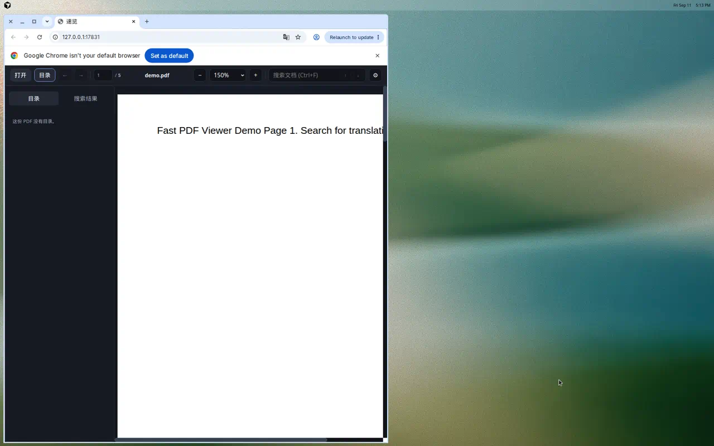

# 速览 Fast PDF Viewer

<p align="center">
  <strong>为技术文档而生的轻量 PDF 阅读器</strong> — 快开、连续滚动、浏览器式前进/后退、全文搜索、划词 AI 翻译。
</p>

<p align="center">
  
</p>

> 示意图：深色阅读界面、侧栏目录与搜索、默认 150% 缩放。克隆仓库后运行 `python desktop/app.py` 即可体验。

---

## Why 速览？

Edge / Chrome 内置 PDF 预览常见问题：

- 大文件打开慢、滚动不够顺
- 从目录或搜索结果跳走后，**很难回到刚才读的位置**
- 搜索体验弱，缺少「第几条 / 共几条」的结果列表
- 英文技术文档需要 **划词翻译**，而不是开一个聊天窗口

速览只做 **阅读**：不编辑、不签名、不同步账号、不做 RAG Chat。

---

## Features

| 能力 | 说明 |
| --- | --- |
| 快速打开 | pdf.js 按需渲染，页缓存默认 8 页（基准验证） |
| 连续滚动 | IntersectionObserver + 预取，快速滚动约 60 FPS |
| 缩放 | 适合宽度 / 适合页面 / 50%–500%，Ctrl + 滚轮 |
| 搜索 | 全文索引、侧栏结果列表、**第 3 条 · 共 47** 计数、Enter / Shift+Enter 跳转 |
| 目录 | PDF Outline，当前阅读章节高亮 |
| 导航 | 鼠标侧键、Alt+←/→、Backspace 前进/后退 |
| 阅读位置 | 同一文档再次打开时恢复页码与滚动（本机 `localStorage`） |
| 划词翻译 | OpenAI 兼容 API（默认 OpenRouter），选中即译，可复制/重试 |
| 桌面 + 网页 | 桌面：Python + WebView2；网页：本地选/拖 PDF，**不上传** |

---

## Quick Start

**Windows · Python 3.10+**（最短可靠路径）

```powershell
git clone https://github.com/Stewart222b/fast-pdf-viewer.git
cd fast-pdf-viewer
python -m pip install -e .
fast-pdf
```

打开指定文件：

```powershell
fast-pdf D:\docs\manual.pdf
```

无桌面窗口时（或未装 pywebview）自动用系统浏览器：

```powershell
fast-pdf --browser
```

首次启动会自动下载 pdf.js 到 `web/vendor/pdfjs/`。

### 其他安装方式

| 方式 | 命令 | 说明 |
| --- | --- | --- |
| 经典 pip | `pip install -r requirements.txt` + `python desktop/app.py` | 与早期文档一致 |
| pipx（隔离环境） | `pipx install -e .` 或 `pipx run --spec git+https://github.com/Stewart222b/fast-pdf-viewer.git fast-pdf` | 适合不想污染全局 Python |
| uv | `uv tool install -e .` | 与 pipx 类似，需已安装 [uv](https://github.com/astral-sh/uv) |
| 网页版（本地） | `python desktop/app.py --browser` 后访问 `http://127.0.0.1:17831/` | 点击打开或拖入 PDF |
| GitHub Pages | 合并到 `main` 后由 Actions 部署 `web/` | 需先 vendor pdf.js；**PDF 仅在浏览器本地处理** |

Windows 独立 `.exe`：尚未提供；推荐 **pip / pipx + `fast-pdf`** 或 **GitHub Releases 源码包 + `pip install -e .`**。

---

## Shortcuts

| 操作 | 快捷键 |
| --- | --- |
| 打开 | Ctrl+O，或拖入 PDF |
| 后退 | 鼠标后退键、Alt+←、Backspace |
| 前进 | 鼠标前进键、Alt+→ |
| 搜索 | Ctrl+F |
| 缩放 | Ctrl + 滚轮，默认 150% |
| 关闭翻译气泡 | Esc |

---

## AI Translation

1. 点击工具栏 **⚙ 设置**
2. 填写 **API Base URL**（默认 `https://openrouter.ai/api/v1`）、**API Key**、**模型**（默认 `openai/gpt-4o-mini`）、目标语言
3. 在正文中 **划词**，气泡会自动请求译文；可 **取消**、**重试**，选区变化会重新翻译

支持任意 **OpenAI Chat Completions 兼容** 端点（OpenRouter、OpenAI、本地代理等）。

单次选中文本上限 **4000** 字符；超时默认 60 秒。

---

## Privacy

| 数据 | 存放位置 |
| --- | --- |
| API Key、Base URL、模型、语言 | 本机浏览器 `localStorage`（键名 `fast-pdf-viewer-settings`） |
| 阅读位置（页码/滚动） | 本机 `localStorage`（按文档指纹） |
| PDF 内容 | 桌面版：本机路径 + 本地 HTTP Range；网页版：**File API / blob URL**，不经过我们的服务器 |

翻译时，**选中文本与你的 API 配置** 从本机直接发往你配置的 API 提供商。我们不会收集或中转 PDF 与密钥。

---

## Development

```bash
python -m pip install -e .
python desktop/bootstrap_pdfjs.py   # 若 vendor 缺失
python desktop/app.py --browser samples/demo.pdf
```

测试：

```bash
node --experimental-vm-modules --test tests/*.test.mjs
python -m unittest tests/test_http.py
node tests/browser-smoke.mjs      # 需已启动 --browser 服务
node tests/render-benchmark.mjs   # Phase 1 渲染基准
```

架构要点：

- **Reader Core**：`web/js/viewer.js`、`search.js`、`history.js` — 渲染与阅读逻辑
- **Platform**：`web/js/platform/` — 桌面（`/api/startup`、pywebview 选文件）与纯 Web
- **桌面宿主**：`desktop/app.py` — 静态资源 + Range PDF + WebView2

---

## Install with Agent

复制以下提示词给 Cursor / Claude / 其他编码 Agent，在 Windows 上安装并打开速览：

```text
请在我这台 Windows 电脑上安装 GitHub 仓库 Stewart222b/fast-pdf-viewer：
1. 若未安装 Git，先安装 Git for Windows。
2. 克隆 https://github.com/Stewart222b/fast-pdf-viewer.git 到用户目录下的 fast-pdf-viewer。
3. 需要 Python 3.10+；在仓库根目录执行：python -m pip install -e .
4. 运行 fast-pdf 启动阅读器；若有样例 PDF 可执行 fast-pdf samples/demo.pdf。
5. 若 pywebview 无法创建窗口，使用 fast-pdf --browser 并告诉我本地 URL。
6. 划词翻译需在应用内设置 OpenRouter（或 OpenAI 兼容）API Key，密钥只存本机 localStorage。
```

---

## License

MIT — 见 [LICENSE](LICENSE)。
