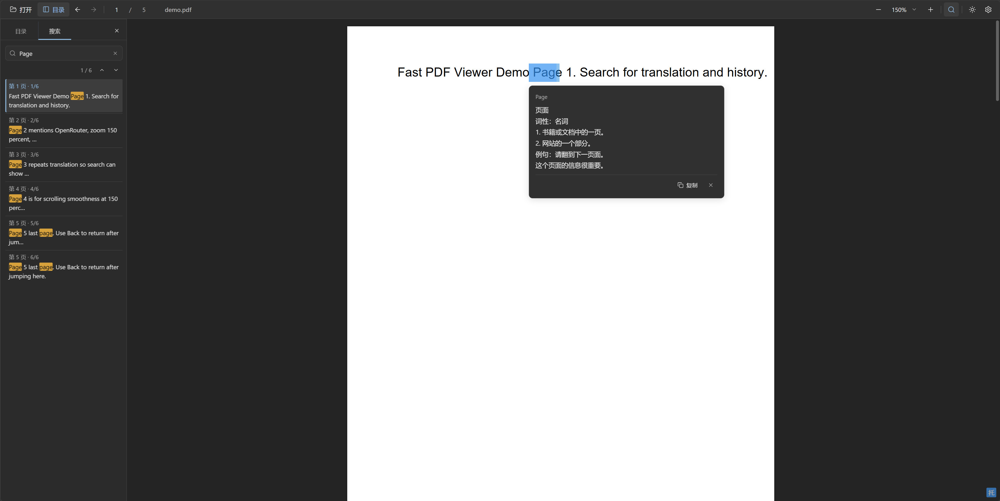

# Fast PDF Viewer – AI Translation

<p align="center">
  <strong>为技术文档而生的轻量 PDF 阅读器</strong> —— 极速打开、连续滚动、层级目录定位、全文侧栏搜索、划词 AI 翻译与双主题切换。
</p>

<p align="center">
  <a href="https://stewart222b.github.io/fast-pdf-viewer/">在线体验 Web 阅读器</a>
  ·
  <a href="https://github.com/Stewart222b/fast-pdf-viewer">GitHub</a>
</p>

<p align="center">
  
</p>

> 轻量本地 PDF 阅读器，支持目录、全文搜索、历史导航、划词 AI 翻译和深浅色主题。PDF 阅读过程在本地完成。

---

## 核心特性

| 功能模块 | 特性说明 |
| :--- | :--- |
| **快速打开与滚动** | 基于 pdf.js 按需渲染和动态缓存，针对大型文档与连续滚动进行优化。 |
| **目录与章节定位** | 树状目录展示，支持展开/折叠，并能精确高亮当前章节。 |
| **侧栏全文搜索** | 提供命中列表、结果计数、摘要高亮和逐项跳转。 |
| **历史导航** | 支持前进、后退以及跳转后返回原阅读位置。 |
| **主题与阅读进度** | 支持深色/浅色主题，并在本地记住主题和阅读位置。 |
| **划词 AI 翻译** | 选中文本即显示翻译气泡，支持流式输出、重试、复制和模型筛选。 |
| **桌面与 Web** | 支持原生窗口、本地浏览器模式和 GitHub Pages Web 版；PDF 阅读过程在本地完成。 |

---

## 快速开始

### Chrome / Edge 扩展

扩展沿用同一套阅读器，可打开本地 PDF，并提供在线 PDF 链接的手动打开入口和可选的自动接管。

```bash
python desktop/bootstrap_pdfjs.py
node scripts/build-extension.mjs --zip
```

在浏览器扩展管理页启用开发者模式，选择“加载已解压的扩展程序”，加载 `dist/browser-extension/`。
安装后在“扩展设置”中开启“自动打开 PDF”。不同浏览器的接管能力、安装步骤和发布前验证项目见 [扩展说明](docs/browser-extension.md)。

`dist/browser-extension.zip` 是分发包；商店上架需要另外提交和审核。

### 在线体验（无需安装）

在浏览器中打开 **[https://stewart222b.github.io/fast-pdf-viewer/](https://stewart222b.github.io/fast-pdf-viewer/)**，点击打开文件或将 PDF 拖入窗口即可。页面由仓库 `web/` 目录经 GitHub Pages 发布，与本地 `--browser` 模式同一套前端。

若 Pages 暂不可用，可在仓库根目录执行：

```bash
python desktop/app.py --browser
```

然后访问终端提示的本地地址（默认 `http://127.0.0.1:17831/`）。如果默认端口被占用，程序会自动尝试后续端口，请以终端输出为准。

运行需要 Python 3.10+ 和现代浏览器。安装包默认安装 `pywebview` 用于原生窗口；未安装时会回退到系统浏览器。

```bash
# 克隆并安装
git clone https://github.com/Stewart222b/fast-pdf-viewer.git
cd fast-pdf-viewer
python -m pip install -e .

# 启动阅读器
fast-pdf
```

打开指定 PDF 文件：

```bash
fast-pdf /path/to/manual.pdf
```

在浏览器中使用：

```bash
fast-pdf --browser
```

首次运行，或检测到 pdf.js 资源缺失/校验失败时，程序会从网络自动下载资源。默认端口为 `17831`，被占用时会自动切换，也可用 `--port` 指定。

---

## 常用快捷键

| 操作类别 | 操作描述 | 快捷键 / 鼠标动作 |
| :--- | :--- | :--- |
| **打开文件** | 打开本地 PDF | `Ctrl+O` / `Cmd+O`，或直接拖拽文件 |
| **页面导航** | 前进、后退或返回原阅读位置 | `Alt+←` / `Alt+→`、`Backspace`、鼠标侧键 |
| **全文搜索** | 打开并聚焦搜索框 | `Ctrl+F` / `Cmd+F` |
| **缩放** | 放大或缩小 | `Ctrl` / `Cmd` + 滚轮，或 `Ctrl` / `Cmd` + `+` / `-` |
| **关闭界面** | 关闭搜索、设置弹窗或翻译气泡 | `Esc` |

---

## 划词 AI 翻译配置

选中文本即可显示翻译气泡。打开设置后填写：

1. **API Base URL**：兼容 OpenAI 标准的服务端点，默认为 `https://openrouter.ai/api/v1`。
2. **API Key** 和 **模型**：模型可直接输入，也可在聚焦模型输入框时从推荐列表中选择。
3. **目标语言**：支持简体中文、繁体中文、English、日本語等。

划词后会自动请求译文；点击气泡右上角 `X` 或按 `Esc` 可关闭气泡并中止请求，失败时可重试或复制结果。

> 单次划词文本上限为 **4000** 个字符，默认请求超时时间为 60 秒。翻译请求会从前端直接发送到你配置的 API 端点；在浏览器或 WebView 中使用时，该端点必须允许跨域请求。

---

## 隐私与安全

- PDF 在本地解析和读取，不会上传 PDF 文件。
- 启用翻译后，只有选中的文本会从前端直接发送到你配置的 API 端点。
- API Key 和阅读位置保存在浏览器 `localStorage`，未加密；不要在共享设备上使用敏感凭证。
